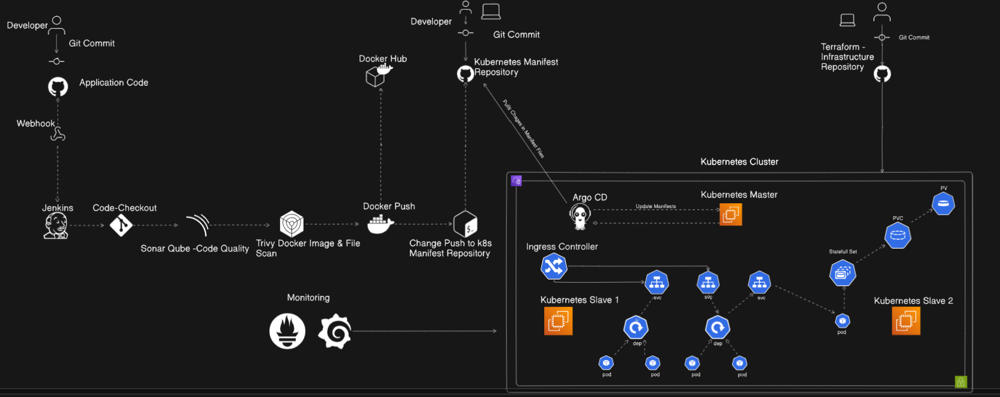

#  CI/CD Pipeline with Jenkins | SonarQube | Trivy | Docker | ArgoCD
#  Infrastructure with Terraform | Ansible

I built, containerized, and deployed this application while learning full-stack development and deployment practices. This project reflects my hands-on experience with the **MERN stack**, Docker, CI/CD pipelines, and Kubernetes-based deployment. It helped me understand how to take an application from development to production using modern tools and workflows.

- Dockerized application with secure image practices
- CI/CD pipeline using Jenkins with SonarQube and Trivy integration
- Auto-deployment to Kubernetes using ArgoCD (GitOps)
---

## 📌 Features

- ✅ Code Checkout from GitHub
- ✅ Code Quality Scan using SonarQube
- ✅ Docker Image Build & Push to Docker Hub
- ✅ Image Vulnerability Scanning via Trivy
- ✅ Auto-update Kubernetes Manifests with Image Tag
- ✅ GitOps Deployment with ArgoCD
- ✅ (Optional) Prometheus/Grafana Monitoring

---

## 🛠️ Tech Stack

| Tool       | Purpose                                      |
|------------|----------------------------------------------|
| Jenkins    | Continuous Integration/Delivery              |
| SonarQube  | Static Code Analysis                         |
| Trivy      | Docker Image Vulnerability Scan              |
| Docker     | Containerization                             |
| ArgoCD     | GitOps-based Kubernetes Deployment           |
| Kubernetes | Container Orchestration                      |

---

## 🚀 CI/CD Workflow

1. **Code Checkout:** Jenkins pulls code from GitHub.  
2. **SonarQube Scan:** Code is scanned for bugs and vulnerabilities.  
3. **Docker Build & Push:** A Docker image is built and pushed to Docker Hub.  
4. **Trivy Image Scan:** The pushed image is scanned for vulnerabilities.  
5. **Manifest Update:** Kubernetes YAML is updated with the new image tag.  
6. **GitOps Deploy:** ArgoCD auto-syncs the manifest repo and deploys the app to Kubernetes.  

## 📚 Useful Resources

- 📘 [Jenkins Documentation](https://www.jenkins.io/doc/)
- 📘 [SonarQube Documentation](https://docs.sonarsource.com/)
- 📘 [Trivy Documentation](https://aquasecurity.github.io/trivy/)
- 📘 [Docker Documentation](https://docs.docker.com/)
- 📘 [ArgoCD Documentation](https://argo-cd.readthedocs.io/)
- 📘 [Kubernetes Documentation](https://kubernetes.io/docs/)

